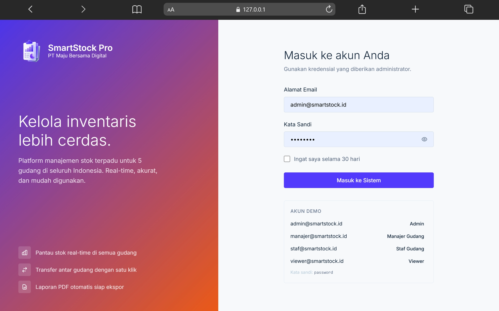
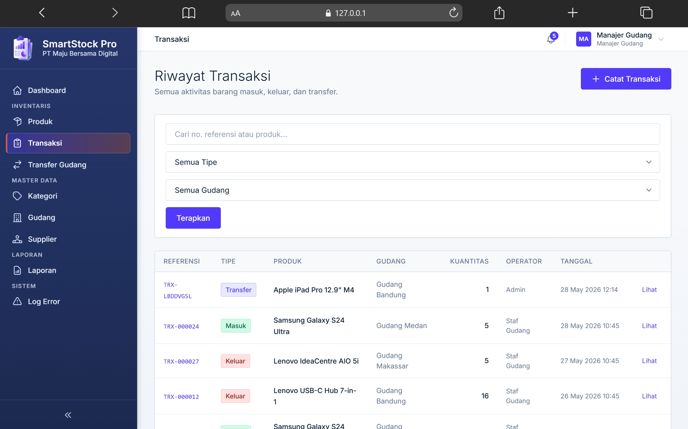
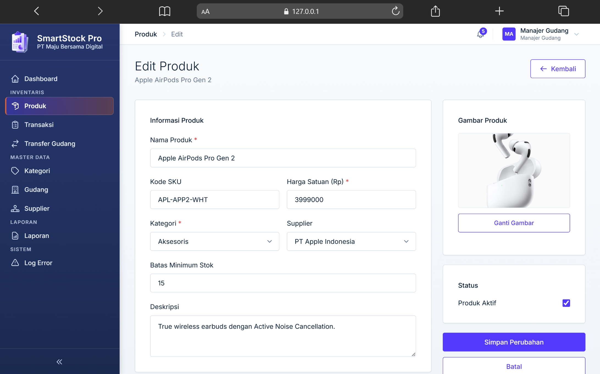

<div align="center">
  

  # SmartStock Pro

  Sistem Manajemen Inventaris berbasis web untuk **PT Maju Bersama Digital**

  [](https://laravel.com)
  [](https://php.net)
  [](https://mysql.com)
  [](https://tailwindcss.com)
  [](https://alpinejs.dev)
  [](https://vitejs.dev)
  [](LICENSE)

  Repositori ini dapat diakses di [github.com/HusniAbdillah/SmartStock-Pro-BNSP](https://github.com/HusniAbdillah/SmartStock-Pro-BNSP)

  > Dikembangkan untuk memenuhi prasyarat **Sertifikasi BNSP Skema Web Developer**
</div>

<div align="center">
  <a href="docs/Dokumen_Penjelasan_Singkat_Proyek.pdf">Dokumen Penjelasan Singkat Proyek (PDF)</a>
</div>

<div align="center">
  <table>
    <tr>
      <td></td>
      <td></td>
    </tr>
    <tr>
      <td></td>
      <td></td>
    </tr>
  </table>
</div>

---

## Tentang Aplikasi

SmartStock Pro adalah platform manajemen inventaris multi-gudang yang dirancang untuk membantu **PT Maju Bersama Digital** dalam memantau stok produk secara real-time, mengelola transaksi gudang, serta menghasilkan laporan inventaris yang komprehensif.

**Fitur unggulan:**
- Dashboard analitik dengan grafik & peta lokasi gudang interaktif
- Manajemen produk, kategori, dan supplier
- Transaksi stok masuk / keluar / transfer antar gudang
- Ekspor laporan inventaris ke PDF
- Impor data produk via Excel
- Sistem audit log & notifikasi
- Manajemen pengguna dengan 4 level hak akses

---

## Prasyarat

| Kebutuhan | Versi |
|-----------|-------|
| PHP | 8.2+ |
| Composer | 2.x |
| Node.js | 18.x |
| MySQL | 8.0 |
| Ekstensi PHP | `gd`, `pdo_mysql`, `mbstring`, `zip`, `bcmath` |

---

## Instalasi

**1. Clone repositori**

```bash
git clone https://github.com/HusniAbdillah/SmartStock-Pro-BNSP.git
cd SmartStock-Pro-BNSP
```

**2. Install dependensi**

```bash
composer install
npm install
```

**3. Konfigurasi environment**

```bash
cp .env.example .env
php artisan key:generate
```

Sesuaikan koneksi database di file `.env`:

```env
DB_DATABASE=smartstock
DB_USERNAME=root
DB_PASSWORD=your_password
```

**4. Migrasi & seeder database**

```bash
php artisan migrate --seed
```

**5. Build aset frontend**

```bash
# Produksi
npm run build

# Pengembangan (hot-reload)
npm run dev
```

**6. Jalankan aplikasi**

```bash
php artisan serve
```

Buka **`http://127.0.0.1:8000`** di browser.

**7. Queue worker** *(opsional — untuk ekspor laporan PDF besar)*

```bash
php artisan queue:work --tries=2
```

---

## Akun Demo

| Peran | Email | Password |
|-------|-------|----------|
| Administrator | admin@smartstock.id | password |
| Manajer Gudang | manajer@smartstock.id | password |
| Staf Gudang | staf@smartstock.id | password |
| Viewer | viewer@smartstock.id | password |

---

## Stack Teknologi

| Lapisan | Teknologi |
|---------|-----------|
| Backend | Laravel 11, PHP 8.2 |
| Frontend | Tailwind CSS 3, Alpine.js 3, Vite |
| Database | MySQL 8.0 |
| PDF | DomPDF (barryvdh/laravel-dompdf) |
| Excel | Maatwebsite Excel |
| Peta | Leaflet.js + OpenStreetMap |
| Grafik | Chart.js 4 |
| Autentikasi | Laravel Breeze (session-based) |

---


